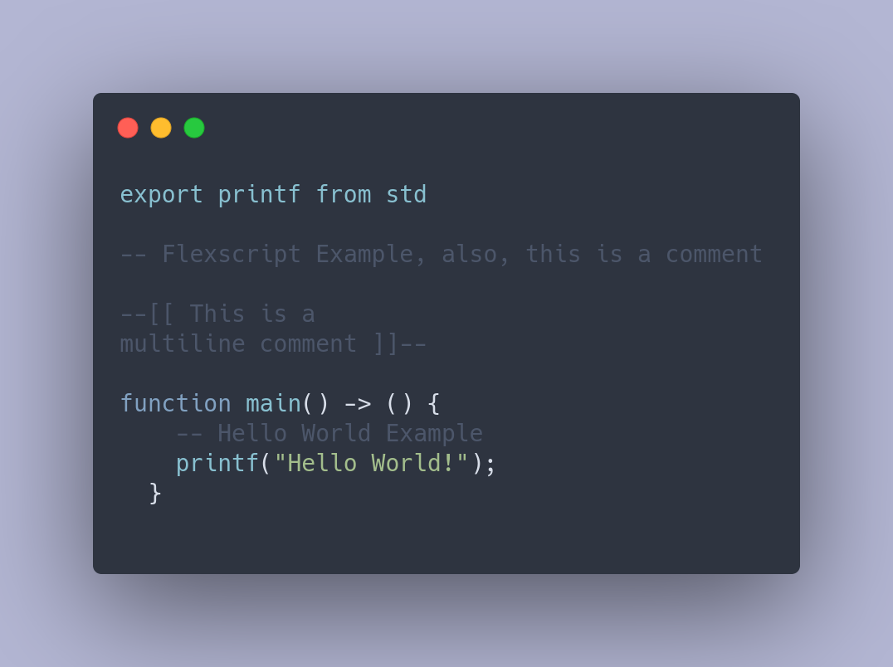
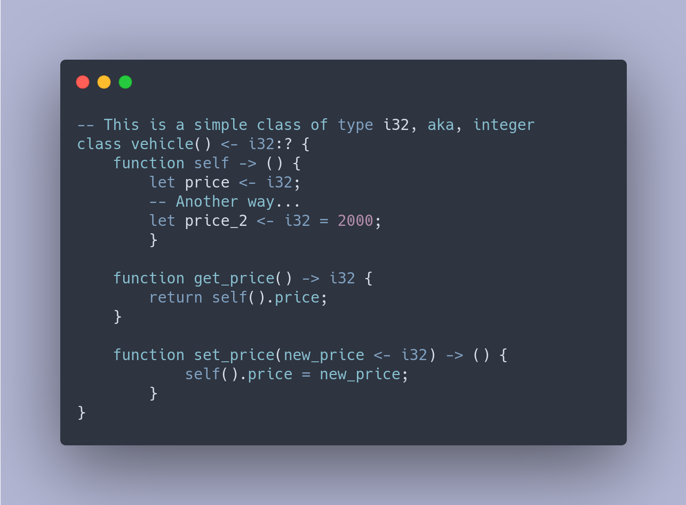
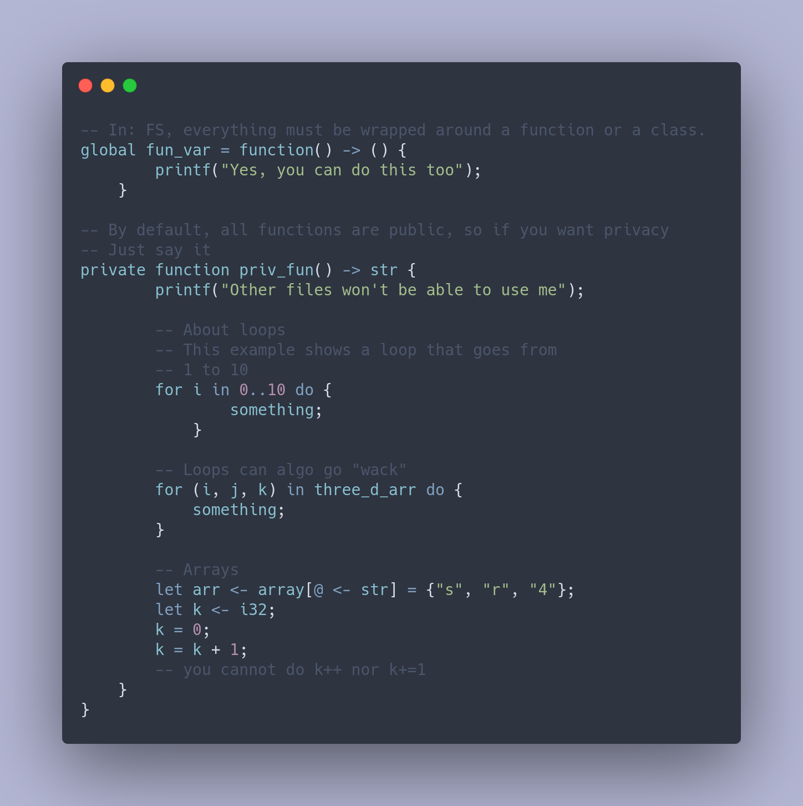
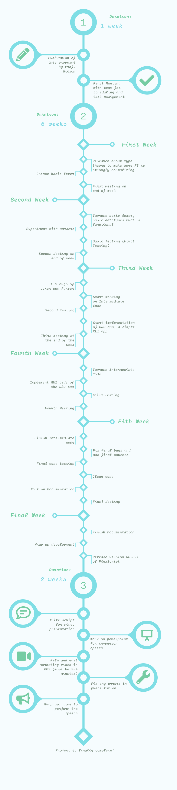

# Proposal
### The FlexScript scripting language
 
*ICOM/CIIC - Introduction to Programming Languages*
Authors: Angel Garcia, Ezequiel Rosario, Christopher Torres
Review Manager: Wilson Rivera
Status: Pending

September 9, 2021

### Introduction
This proposal introduces a better scripting language that focuses on scalability and readability. Although we have languages such as LUA, python, bash, zsh and other scripting language, none was suited for large projects where dozens if not hundreds of scripts would be executed where scalability and maintenance could not end into a nightmare of a task for developers. Here we propose the creation of a language named "FlexScript" that tackles these issues using Java as a layer, similar to how C was used to create Python. 

### Motivation
Creating bash scripts whose syntax is somewhat loose or creating scripts with many dependencies like the ones seen in many node.js project. One then may argue the use of Python for scripting. While Python is a well-made and a popular scripting language, it can be slow and variable types could become a nightmare to manage due to its duck-typing perk. Although it is true that one could switch for a language that is faster and more robust, such as Java, it is a very large language, which makes it harder to master properly. 

As such, the Flex Team aims to provide a faster and more flexible alternative to Python and similar scripting languages. We aim to make a scripting language with a hybrid of the Object-Oriented Paradigm and Functional Programming Paradigm, giving it the ease of use by keeping the language as small as possible (much like Lua), yet with flexibility and scalability. 

#### Language Features
Most scripting languages on the UNIX side focus on the functional programming paradigm and lack any possibility to greatly expand as a language being just managing a bunch of files or simple control-flow in small simple scripts. By adding OOP features, a scripting language could easily be utilized for large scalable projects. To put it simple, FlexScript is made so you can fix your problems then and there, having the best of functional programming languages like bash, while also bringing OOP elements like PowerShell does.

With the use of object-oriented programming (OOP), another feature that will greatly increase the ease of access for users is the creation of Drag and Drop (D&D) programming features. Implementing D&D features into FlexScript will allow both new and veteran programmers to create scripts, functions, sets, lists, and other coding elements in an easy and personalized fashion. 

### Example of a program in FS

    

    

    

### Implementation requirements and tools

FlexScript will be based on the Java programming language, using JFlex as our lexical analyzer generator to identify and read certain characters and make functions to ease the coding process. For the user, the lexer can be utilized to define and read expressions, recovering from errors faster, which allows the program to continue despite them, whenever possible.  

The AWT and Swing libraries will also be crucial for the creation of a D&D environment. UI design and mouse interaction are necessary for a proper interactive space.  

Lastly, JavaParser will be used redundantly as a parser for our project. A parser will allow an Abstract Syntax Tree (AST) to interact with the code as objects, allowing us to obtain the OOP environment we envision. 

### Project Timeline

    

### Impacts/Backwards Compatibility Issues

### Reference

Klein, Gerwin. “JFlex - JFlex User’s Manual.” JFlex, www.jflex.de/manual.html. Accessed 2 Sept. 2021.

 

“Javaparser-Core 3.23.0 Javadoc (Com.Github.Javaparser).” Javaparser - Javadocs, www.javadoc.io/doc/com.github.javaparser/javaparser-core/latest/index.html. Accessed 2 Sept. 2021.

 

"D&D Beyond" https://www.dndbeyond.com. D&D beyond - an official digital toolset for dungeons & dragons (D&D) fifth edition (5e). Accessed 2 Sept. 2021.
